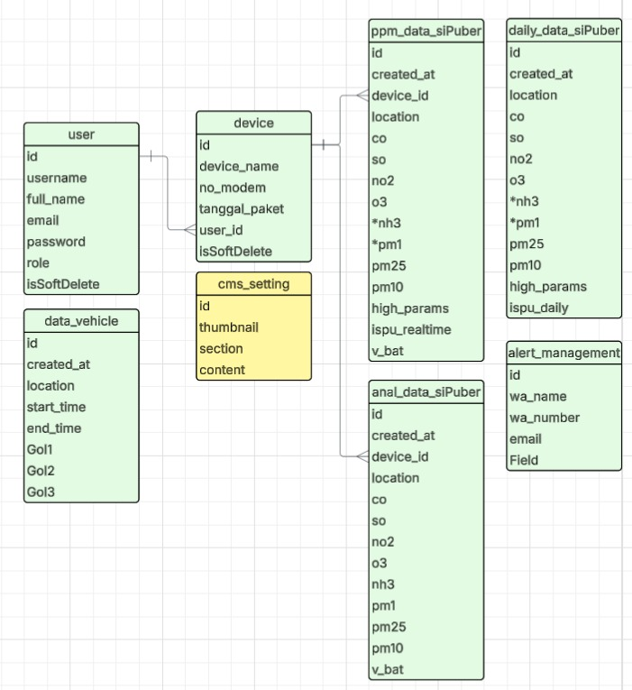

<h1 align="center">🌍 SiPuber – Smart IoT Air Quality Monitoring System</h1>

  <strong>Front-end Developer – BRIN (Yogyakarta, Indonesia)</strong> 
  <em>February 2025 – June 2025</em>

---

## 🔍 Overview  
Developed the **SiPuber (Sistem Pemantauan Udara Bergerak Berbasis IoT)** web application to visualize real-time air quality data collected from IoT devices. The system integrates **TypeScript**, **Leaflet**, **ShadCN**, and **Supabase (PostgreSQL)** to deliver **interactive heatmaps**, **data tables**, and **real-time environmental analytics** for air quality monitoring in urban areas.

---

## ⚙️ Tech Stack  
| Layer | Technology |
|:------|:------------|
| **Framework** | Next.js |
| **Frontend** | TypeScript, Leaflet, React, ShadCN |
| **Database** | PostgreSQL (with PostGIS & TimescaleDB)|
| **Backend** | Node.js, Redis, BullMQ |
| **Visualization** | Heatmap (Leaflet), Dynamic Table (ShadCN) |
| **Integration** | REST API, WebSocket, Supabase |

---

## 🧠 System Architecture  
IoT devices send air quality data to the **server via API (POST)** → data is cached in **Redis** for one day → processed by **BullMQ** for daily averaging → stored in **PostgreSQL** with **PostGIS** and **TimescaleDB** for spatial and temporal analytics.  
The frontend retrieves processed data using **GET**, **POST**, and **PATCH** requests, updated **in real time via WebSocket**.  
An alert management system detects threshold exceedances and triggers notifications via API or email.  

**System Architecture Diagram**  

---

## 🗄️ Database Structure  
The database includes entities for **users**, **devices**, and **air quality data**, designed to support spatial and temporal monitoring.

| Table | Description |
|--------|--------------|
| **users** | Stores system user data |
| **devices** | Represents IoT devices registered by each user |
| **ppm_data_sipuber** | Real-time air quality readings |
| **daily_data_sipuber** | Aggregated daily averages |
| **anal_data_sipuber** | Analog Sensor data |
| **alert_management** | Stores notification and alert recipients |
| **data_vehicle** | Tracks vehicle movement related to pollution sources |
| **cms_setting** | Manages dynamic frontend content |

**Database Schema**  

---

## 💻 Key Features  
- **Real-time Heatmap Visualization** using Leaflet (ISPU category-based colors: Green → Good, Yellow → Moderate, Orange → Unhealthy, Red → Very Unhealthy, Purple → Hazardous)  
- **Dynamic Data Table** with filters (city, date range, pollutant columns) and CSV export  
- **Interactive Charts** showing pollutant trends and daily averages  
- **Responsive UI** optimized for web and tablet displays  
- **Automated Alerts** for threshold exceedance via BullMQ and API notifications  

**Heatmap Visualization**  

**Data Table View**  

---

## 📈 Future Enhancements  
- Machine learning-based pollution forecasting  
- Advanced analytics dashboard with predictive trends  
- Real-time public alert integration (Whatsapp / push notifications)

---

## 🧾 License  
This project is released under the **MIT License**.  
See the [LICENSE](./LICENSE) file for more details.

---

  <strong>Developed by</strong> 
  <b>Rizqi Raffy Imam Malik</b> 
  <em>Full Stack Engineer @ BRIN (National Research and Innovation Agency)</em> 
  📍 Yogyakarta, Indonesia  
   📧 <a href="mailto:rizqiraffy@gmail.com">rizqiraffy@gmail.com</a>  
   🔗 <a href="https://www.linkedin.com/in/rizqiraffy/">linkedin.com/in/rizqiraffy</a>

